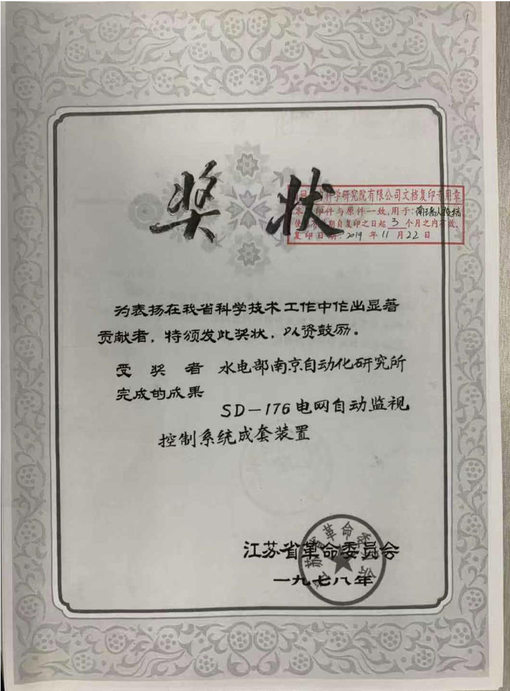
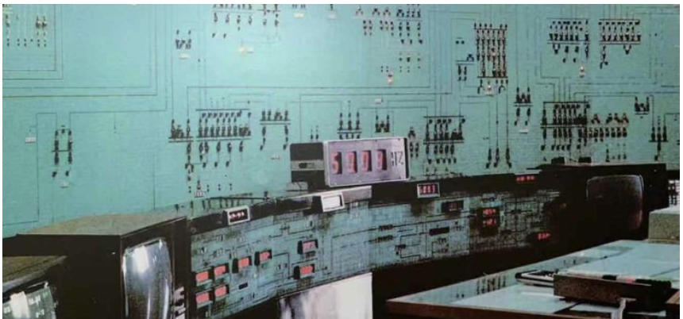
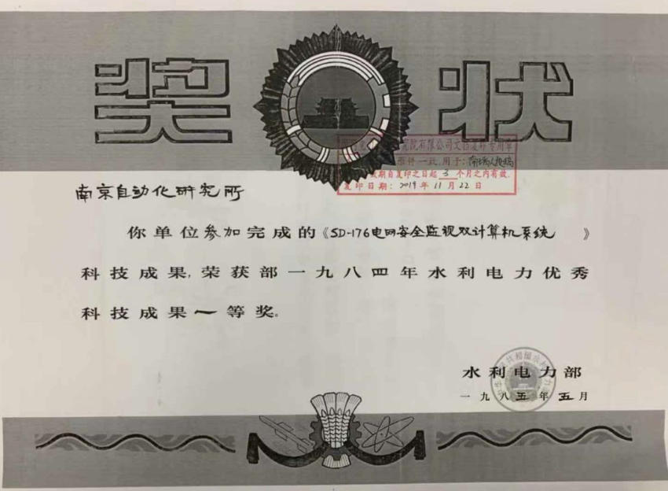
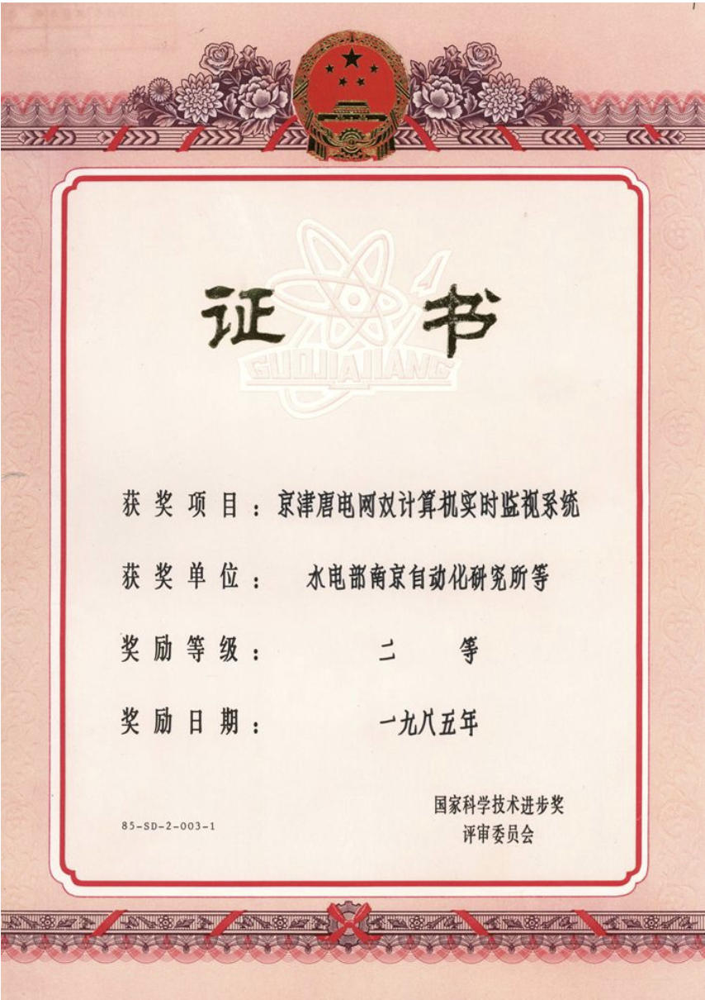

# 调度自动化系统的发展

本文主要聊一聊电力调度自动化系统，更准确的说，电网调度主站系统。
##啥是电力调度自动化系统？

“电力调度自动化系统(简称自动化系统)是电力系统的组成部分，是确保电力系统安全、优质、经济运行的基础设施，是提高电力系统运行水平的重要技术手段。自动化系统由主站系统、子站设备和数据传输通道构成。”[^ref01]      ——DLT/516-2017 电力调度自动化系统运行管理规程
[^ref01]: DLT/516-2017 电力调度自动化系统运行管理规程

按照规程给出的定义，主站系统包含电网调度控制系统（基础平台和实时监控与预警、调度计划及安全校核、调度管理…………）、配电网调度自动化主站系统、调度数据网络主站设备、电力监控系统安全防护主站设备、相关基础设备（大屏幕、时间同步装置、UPS…………）。

调度自动化系统是跟着计算机技术、通信技术和应用软件技术发展起来的。先起始于远动自动化，满足了采集、观测的需求，后来随着电网越搞越大，各类大小事件发生，调度人员产生更多的应用需求，促进了装置和应用软件的研发，进一步提升了调度自动化主站系统技术水平。

【但是各位专家，能不能少整点没用的系统，你们想过每个系统后面那些默默无闻的牛马么……】

很久很久以前long long ago ……

## 很久之前的历史

### 1930S前后：

发电厂、变电站已经有伙计用电子管和继电器实现了控制室监盘，多个电厂联合运行出现了新的职业工种：电力调度员。据老毛子说，苏俄第一批电力调度员于1921年12月17日开始协调莫斯科地区6个电厂生产运行[^ref02]。这样看，电力调度员已经出现了100+年了。
[^ref02]: http://en.special.kremlin.ru/events/president/news/67381

但是按照吴张老师们的的说法：设置电力系统调度员始于1940年[^ref03]。【估计毛子老几位应该是没参加持证上岗考试】
[^ref03]: 吴文传、张伯明、孙宏斌，电力系统调度自动化[M]. 北京: 清华大学出版社, 2011.

最早的电力调度员使用固定的系统模拟盘，依靠**电话**与发电厂和变电站运行人员联系，电网状态无法感知，指挥全凭经验。【此处简称“盲调”】【别以为现在技术多厉害了，这么多年了电话还是调度员的主要武器之一，2026年国网调度控制工作要点中提到“因地制宜多措并举解决部分地区变电站“盲调”问题】

### 1940S-1950s：
40年代，调度中心出现了SCADA系统(Supervisory Control And Data Acquisition)，将开关和量测数据接入模拟盘。50年代，出现了自动发电控制（Automatic Generation Control，AGC），其中前苏联在1959年实现了非集中的调整系统（主要使用了电厂侧的频率调整器）。
### 1960s-1970s：
这期间随着模拟技术向数字技术突破转变，第三代计算机技术的飞跃，自动化技术也逐步向数字化转变。场站的远程终端（Remote Terminal Unit，RTU）、通道、控制器等发展成数字型，数字计算机被引进调度中心、发电厂。SCADA、状态估计已成为调度自动化能量管理系统（Energy Management System，EMS）的基础功能，在工程上有了应用。如挪威水利电力局（Tokke）和美国电力公司（AEP）就使用了状态估计程序。

特别是历次电网重大事件进一步推动了调度自动化系统的形成和完善。

1965年纽约大停电事件，促使电力公司考虑在线的电网可靠性问题，加速引进了SCADA/EMS。

1978年美国东西部和法国大停电，促进了网络安全分析的发展。

1983年瑞典电压崩溃事故，促进了电压稳定分析。

…………

### 1980s以来：
配电自动化开始应用，提高供电可靠性和用电质量。90s国内外掀起了电力市场化改革热潮，数据网技术使得调度自动化系统深度互联。

## 我们的努力

我国电力调度自动化系统相较于国外，起步较晚，先后经历了起步探索，四大网引进，消化吸收，全面自主研发，以及智能电网发展提升等阶段。

### 起步探索：
1960-1970S，除西北电网外，我国电网逐步通过220千伏线路互联，以220千伏线路为主网架，以省域为主要供电范围的省级电网开始形成。各级调度对电网的安全监视与控制的需求日益迫切。1979年我国原电力部通信局从日本日立公司引进H-80E工业控制系统。该系统为双机系统，具备高可靠性，主系统H-80E装在原电力部通信调度局（后为国调中心），子系统H-80E装在华北电管局总调度所（后为华北网调）。H-80E系统是中国电网调度自动化从早期远动技术向计算机化监控过渡的关键一环，为其后大规模引进EMS和自主开发调度自动化系统积累了宝贵经验。

同时，由水利电力部南京自动化研究所（国网电力科学研究院/南瑞集团前身）研制的在线小型计算机系统SD-176系统于1977年完成研制，1978年8月在北京电管局中调所的维护管理下，在京津唐电网首次开展电网计算机调度。该系统获得江苏省革命委员会的表彰。

针对京津唐电网要监视的信息量大、范围广，要实现的自动化功能多等需要，南京自动化研究所和华北电管局总调度所在之前研究成果的基础上共同研制了SD-176电网安全监视双计算机系统，1983年投入试运行，实现了对京津唐电网565个测点、449个开关状态、49台发电机组有功出力、42条22万伏输电线路电流、7个地区的用电负荷的实时监视。该系统替代了H-80E系统。

国家水利电力部授予“SD-176电网安全监视双计算机系统”水利电力优秀科技成果一等奖，国家科学技术进步奖评审委员会授予“京津唐电网双计算机实时监视系统”国家科学技术二等奖。关于SD-176系统的文字图片来源于搜狐网站[^ref04]。
[^ref04]: https://www.sohu.com/a/357355908_700040

H-80E、SD-176系统均为SCADA系统，不具备高级应用支撑能力。但同一时期，我国的电力科研人员也在不断研究各类高级应用软件。1968年，京津唐电网就曾开发过一套经济调度程序，其中包含了网损修正等与潮流相关的计算功能，这套程序虽然未能长期实用,却为1981年重新设计经济调度程序提供了宝贵的经验[^ref05]。1973年，针对我国第一条330kV超高压输电线路建设和跨省输电系统振荡事故分析的实际需求，中国电力科学研究院（中国电科院）在周孝信院士的主持下，开创研究计算机在电力系统中应用的数学模型和计算方法，开发应用潮流和稳定计算程序，获1978年全国科学大会奖。几乎同一时期，西安交通大学的王锡凡教授也率先开发了电力系统潮流、短路、稳定等三大基本计算软件，并受电力部委托举办培训班，为全国电力部门培养了最早的一批技术骨干。
[^ref05]: 于尔铿,洪柏川.京津唐电网经济调度程序设计[J].电力系统自动化,1983年03期

1982年3月，瑞典ASEA公司的SINDAC-3系统在湖北省电力中心调度所投入运行，是我国电力系统第一套计算机化的电网监控系统，主要用于保障我国第一条500kV平武超高压输电线路的安全运行。来自中国电力科学院、哈尔滨工业大学、清华大学等高校基于此套系统，完成了状态估计、潮流计算、负荷预测、经济调度、安全故障分析、最优潮流等九项国产高级应用软件的嵌入验证，从而使这套引进的SCADA系统增加了能量管理系统（EMS）的功能。

### 四大网引进：

20世纪80年代，为满足不同省、地区之间的电力配置要求，我国逐步形成以500（330）kV线路为联络线的跨省区域电网。跨省区域电网的规模不断扩大，对安全、经济调度的要求日益迫切。为此，国家决定以“技贸结合”的方式，为占全国装机容量76%的四大电网（华北、东北、华东、华中）引进标准化的EMS系统，称之为“四大电网引进工程”。

四大电网引进工程分为工程引进和技术引进：工程引进为四个区域电网引进EMS系统；技术引进则通过电力科学研究院、南京自动化研究所各引进一套相同的系统和开发用源码，并负责工程的技术支持，南京自动化设备厂引进远动设备制造金属。工程总用汇额度2000万美元，其中工程引进1550万美元，技术引进450万美元。该工程自1984年10月开始，1985年7月最终由英国西屋公司中标。东北、华中、华北、华东分别于1991年8月、1992年1月、1992年10月和1992年11月通过能源部组织的实用化验收。