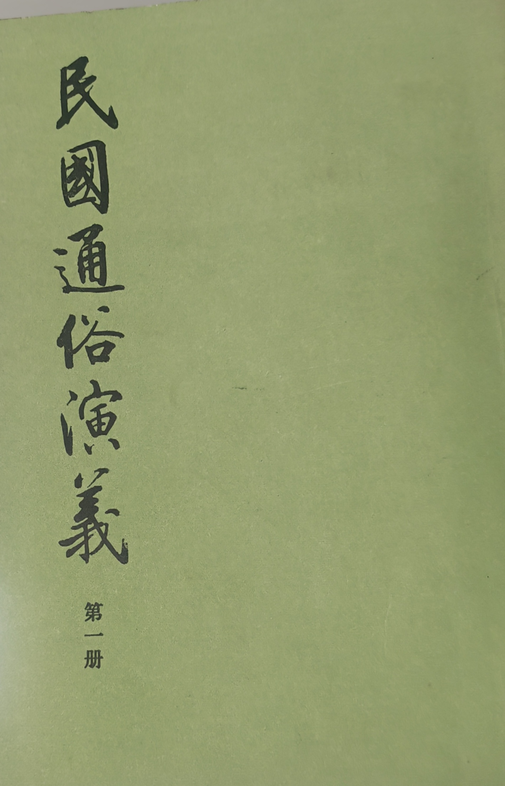
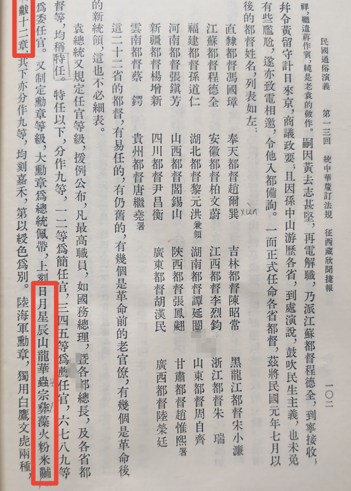

皇权的十二章纹*

##引子
周末读蔡东潘《民国通俗演义》，至第十三回，袁世凯制定各项制度，有文如下：

“袁总统又规定任官等级，援例公布，凡最高职员，如国务总理，暨各部总长，及各省都督等，均称特任，特任以下，分作九等，一二等为简任官，三四五等为荐任官，六七八九等为委任官。又制定勋章等级，大勋章为总统佩带，上刻**日月星辰山龙华虫宗彝藻火粉米黼黻**十二章，其下亦分作九等，均刻嘉禾，第以绶色为别。陆海军勋章，独用白鹰文虎两种，亦分作九等，视绶色为等差。勋章以外，又有勋位，大勋位为首，依次至勋五位为止。余如国务院官制，及各部官制，一一酌定，次第颁行。”

对文中“日月星辰山龙华虫宗彝藻火粉米黼黻十二章”不太了解，只是感觉有点古怪，从查阅资料知此十二物称之为“十二章纹”，是封建皇权的象征，可见老袁皇权端倪。

##十二章纹是什么

十二章纹是中国古代帝王礼服上绘绣的十二种纹饰：日、月、星辰、山、龙、华虫、宗彝、藻、火、粉米、黼、黻等， 通称“十二章”，是中国帝制时代朝服的服饰等级标志。绣有章纹的礼服称为“章服”。

具体内容及含义，知乎上有篇文章水平很高，链接附录于此，不再赘述。

https://zhuanlan.zhihu.com/p/713890416